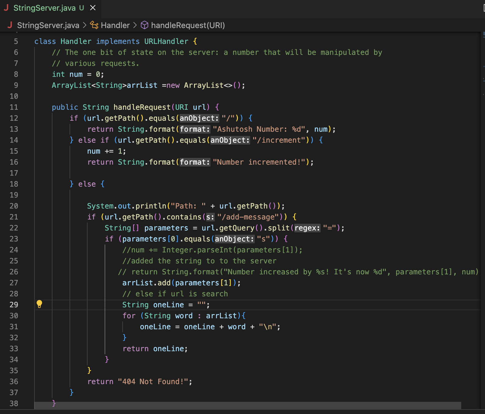
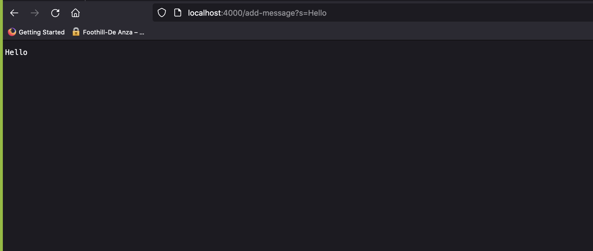
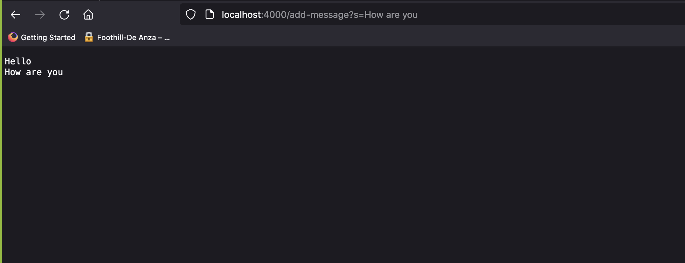
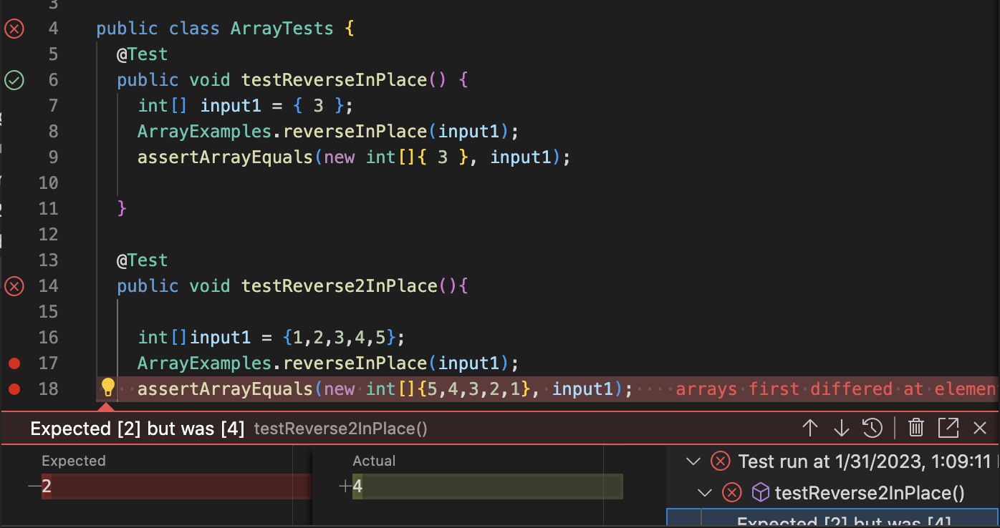

**Lab 3**  
###Part 1
***StringServer***




  
* getPath(),getQuery() add() 
* The parameters changed to string objects.
* 



* getPath(),getQuery() add() 
* The parameters changed to string objects
* The arraylist contains Hello /n How are you


1.  
```
public void testReverse2InPlace(){

    int[]input1 = {1,2,3,4,5};
    ArrayExamples.reverseInPlace(input1);
    assertArrayEquals(new int[]{5,4,3,2,1}, input1);


 }
```
 
 
2.  
```
public void testReverse2InPlace(){

    int[]input1 = {3};
    ArrayExamples.reverseInPlace(input1);
    assertArrayEquals(new int[]{5,4,3,2,1}, input1);


 }
```
Symptoms


Code Before:
```
static void reverseInPlace(int[] arr) {

    for(int i = 0; i < arr.length; i += 1) {
      arr[i] = arr[arr.length - i - 1];
    }  
}
```

Code After:
```
static void reverseInPlace(int[] arr) {

    int newArr[] = new int [arr.length];
    int j = arr.length;
    for(int i = 0; i < arr.length; i += 1) {
      newArr[j-1] = arr[i];
      j--;
    }
    
    for(int i = 0; i<arr.length; i++){
      arr[i]=newArr[i];

    }
}
  


