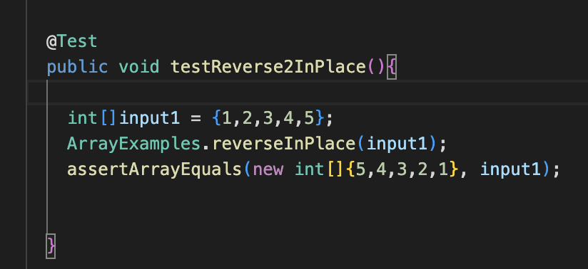
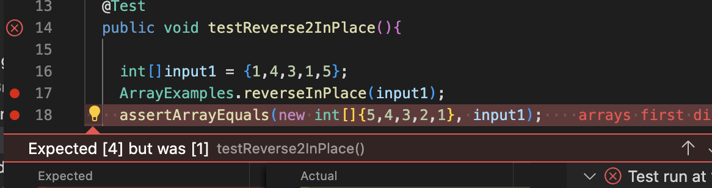

**Lab 3**  
***StringServer***

  
* getPath(),getQuery() add() 
* The parameters changed to string objects.
* 

* getPath(),getQuery() add() 
* The parameters changed to string objects
* The arraylist contains Hello /n How are you

1.  
'public void testReverse2InPlace(){'

    int[]input1 = {1,2,3,4,5};
    ArrayExamples.reverseInPlace(input1);
    assertArrayEquals(new int[]{5,4,3,2,1}, input1);

 }''
 
 
 
2.  
'public void testReverse2InPlace(){

    int[]input1 = {1,2,3,4,5};
    ArrayExamples.reverseInPlace(input1);
    assertArrayEquals(new int[]{5,4,3,2,1}, input1);

 }'
  
  

